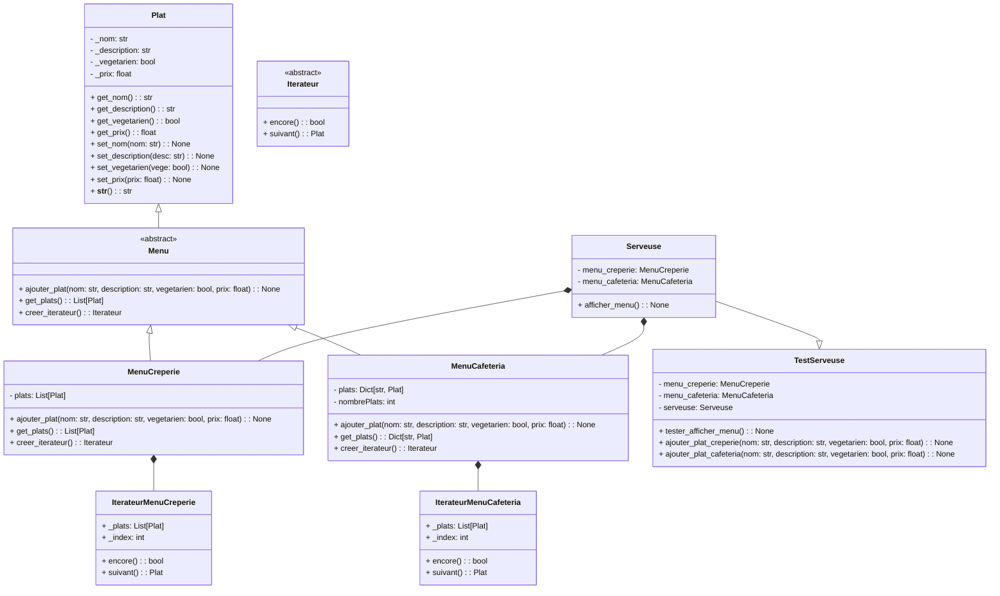
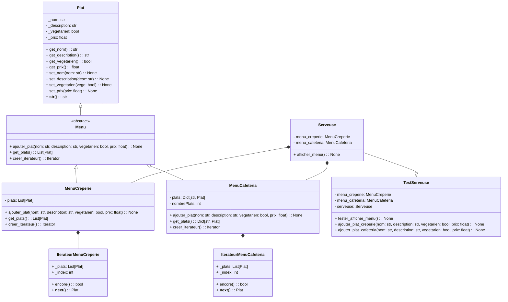

# Génie Logiciel

> Servan PELLÉ
>
> DE3   

## Partie I – Itérateur

## Implémentation 1 

### 4. Vrai / Faux 

- MenuCreperie et MenuCafeteria sont des implémentations concrètes pour une interface non définie.
> __Vrai__. Les classes MenuCreperie et MenuCafeteria sont des implémentations concrètes et il n'y a pas de mention explicite d'une interface qu'elles implémentent.

- La Serveuse n’implémente pas l’API Python Waitresse.
> __Vrai__. La classe Serveuse n'implémente pas une API spécifique appelée Waitresse.

- Si MenuCafeteria utilise un Set alors le code de Serveuse devra être revu.
> __Vrai__. Si MenuCafeteria utilise un Set au lieu d'un Dict, la méthode d'accès aux plats dans la classe Serveuse devra être modifiée car un Set ne supporte pas l'accès par clé.

- L’implémentation de Serveuse respecte la notion d’encapsulation.
> __Faux__. L'implémentation de la classe Serveuse accède directement aux attributs des objets MenuCreperie et MenuCafeteria au lieu d'utiliser des méthodes pour obtenir ces informations, ce qui brise l'encapsulation.

- Nous avons du code dupliqué et une troisième implémentation imposerait une nouvelle boucle.
> __Vrai__. Il y a du code dupliqué pour parcourir les plats des deux menus, et l'ajout d'un troisième menu nécessiterait une nouvelle boucle similaire.

- L'implémentation n'utilise pas un métalangage (XML/JSON) afin d'assurer l’interopérabilité des menus.
> __Vrai__. L'implémentation actuelle n'utilise pas XML ou JSON pour stocker ou échanger les informations des menus, ce qui limite l'interopérabilité.

5. Quelles sont les défauts de cette première implémentation ?

- __Absence d'une interface commune :__ Les classes MenuCreperie et MenuCafeteria ne partagent pas d'interface commune ou de classe de base abstraite. Une interface commune pourrait faciliter l'extension et l'utilisation polymorphique.

- __Manque d'encapsulation :__ La classe Serveuse accède directement aux attributs des objets MenuCreperie et MenuCafeteria. Cela va à l'encontre du principe d'encapsulation. Il serait préférable d'utiliser des méthodes pour accéder aux données.

- __Code dupliqué :__ Il y a du code dupliqué dans la méthode afficher_menu de la classe Serveuse pour parcourir les plats des deux types de menus. Une solution plus générique et extensible devrait être mise en place.

- __Extensibilité limitée :__ Ajouter un nouveau type de menu nécessiterait des modifications significatives dans la classe Serveuse. Cela pourrait être amélioré en utilisant un design plus modulaire.

- __Interopérabilité limitée :__ L'implémentation actuelle ne facilite pas l'interopérabilité avec d'autres systèmes, car elle n'utilise pas de formats standardisés comme JSON ou XML.

## Implémentation 2 

### 6. Diagramme de classes 

## Implémentation 3

### 2. Diagramme de classes

## Partie II - Travail en binôme (Fleisch, Bochu, Pellé)

### Quels sont les points que vous avez réalisés différemment ? Pourquoi ?

> - Répartition des class dans différents fichiers (1 fichier global ou 1 fichier par class).
>
> - Réalisation des diagrammes de classes avec différents outils (drawio ou mermaid)

### Si vous deviez reprendre le travail réaliser maintenant comment aborderiez-vous le TD ?

> - On partirait initialement sur une architecture et des implémentations mieux définient contrairement à ce que à fait dans la première implémentation.
>
> - On aurait préférer aborder dès la première implémentation la solution finale pour étudiée d'autre implémentations plus complexes.

### Si vous deviez mettre une note pour la réalisation de votre binôme quelle serait-elle ? Pourquoi ?

> - 14,5/20
